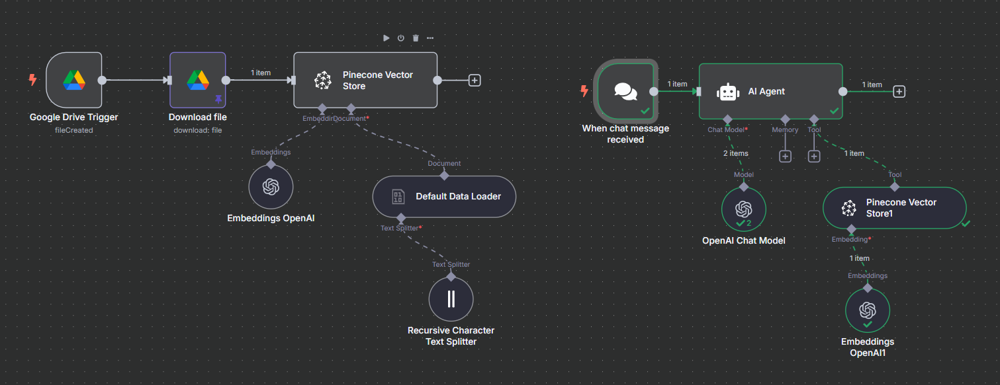
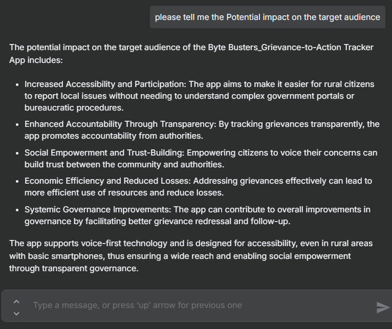

# 🔍 n8n RAG Pipeline & Chatbot

A modular Retrieval-Augmented Generation (RAG) pipeline built using [n8n](https://n8n.io), integrating OpenAI embeddings, Pinecone vector store, and a chatbot interface. Designed for intelligent document querying and conversational AI workflows.

---

## 🚀 Features

- 📂 Google Drive trigger for document uploads
- 🧠 Embedding generation using OpenAI
- 📦 Vector storage and retrieval with Pinecone
- 🧩 Recursive text splitting for better chunking
- 💬 Chatbot interface powered by OpenAI + AI Agent
- 🔁 Fully automated with n8n workflows

---

## 🛠️ Tech Stack

| Component     | Purpose                          |
|--------------|----------------------------------|
| n8n          | Workflow automation              |
| OpenAI       | Embeddings + Chat model          |
| Pinecone     | Vector database for retrieval    |
| Google Drive | Document source + trigger        |
| LangChain    | Text splitting + orchestration   |

---

## 📁 Workflow Files

- [`RAG_pipeline__Chatbot.json`](./RAG_pipeline__Chatbot.json): Full n8n workflow for document-based chatbot with Pinecone + OpenAI.

---

## ⚙️ Setup Instructions

1. **Clone the repository**
   ```bash
   git clone https://github.com/rahul2022B0131055/n8n-rag-pipeline.git
   cd n8n-rag-pipeline
   ```

2. **Import the workflow into n8n**
   - Open your n8n instance
   - Click the **Import** button in the top-right
   - Upload the file `RAG_pipeline__Chatbot.json`

3. **Set up credentials in n8n**
   - Go to **Credentials** in n8n
   - Add:
     - OpenAI API Key
     - Pinecone API Key + Environment
     - Google Drive OAuth2 credentials

4. **Configure your environment**
   - Create a `.env` file in the root directory
   - Use `.env.example` as a reference

5. **Upload a PDF to your connected Google Drive folder**
   - The folder ID is already configured in the workflow
   - Uploading a file will trigger the pipeline

6. **Start chatting**
   - Use the chat trigger node to interact with the AI agent
   - Ask questions based on the uploaded document

## 📦 Environment Variables

If you're using your own API keys (e.g., for self-hosted n8n), create a `.env` file like this:

```env
# OpenAI (only if not using n8n's built-in credits)
OPENAI_API_KEY=your-openai-api-key

# Pinecone
PINECONE_API_KEY=your-pinecone-api-key
PINECONE_ENVIRONMENT=your-pinecone-environment
PINECONE_INDEX=demo2

# Google Drive
GOOGLE_DRIVE_CLIENT_ID=your-client-id
GOOGLE_DRIVE_CLIENT_SECRET=your-client-secret
```

If you're using **n8n cloud with built-in OpenAI credits**, you can skip the `OPENAI_API_KEY` and just configure credentials inside the n8n UI.

## 🧭 Workflow Overview

This diagram shows the full RAG pipeline in n8n:



---

## 💬 Chatbot Interaction Demo

Here’s how the chatbot responds to document-based queries:



